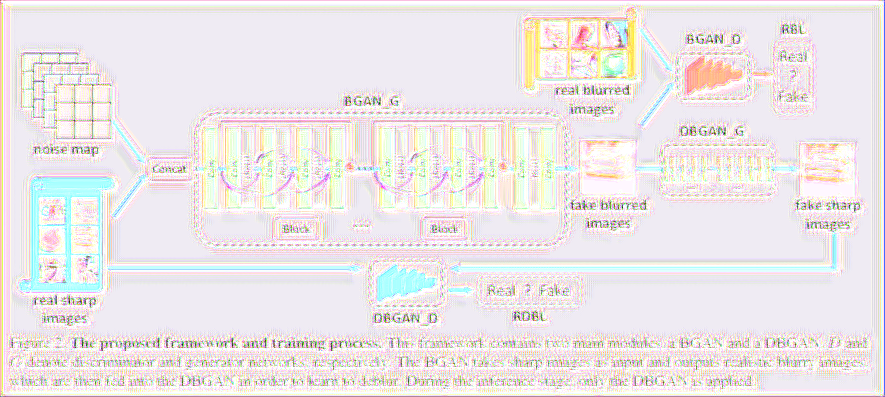
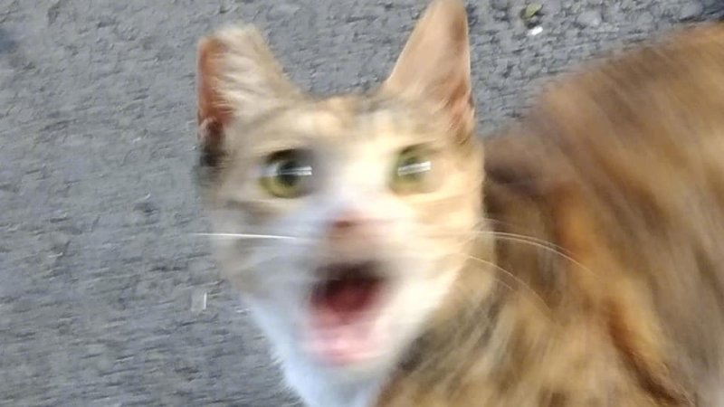
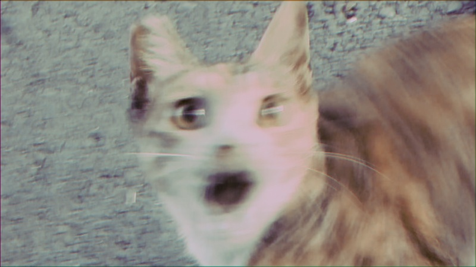

# Deblurring by Realistic Blurring复现

[论文地址](https://arxiv.org/pdf/2004.01860v2.pdf)

使用了两个GAN，一个用来把图片变模糊BGAN、一个用来把图片变清晰DBGAN，前者作为后者的先验

图像生成过程：

1. 清晰的图像传入BGAN，生成模糊的图像
2. 生成的模糊图像与数据集中的模糊图像传入DBGAN，生成清晰图像

损失采用：relativistic blur loss


一般的loss主要是为了保证GAN生成网络具有以下效果:

1. 使得判别器网络认为img是real类别的概率无限趋近于1
2. 使得判别器网络认为img是fake类别的概率无限趋近于0

relativistic blur loss的主要目的就为中和这两种评判，使得两种概率都趋于0.5

> 需要注意的是，我们并不是要生成真实图像，而是要欺骗判别器

## 数据集

文章采用GoPro数据集和论文作者自己创建的真实图像数据集

## 网络结构


BGAN：用于生成模糊图像，清晰图像来自GoPro，模糊图像来自真实世界拍摄，两者并不匹配

GBGAN：用于生成清晰图像，参考DeblurGAN做了一点修改

### BGAN

1. 使用random(4\*128\*128)加到原图上，形成初步的模糊图
2. 1个Conv2d --> 9个ResBlock --> 2个Conv2d
3. ResBlock: 5个Conv2d(64, 3, 3) --> 4个LeakyReLU
4. 还有一个从输入连到输出的ResBlock

判别器与SRGAN一致

Q: 为什么数据集可以不匹配？

A: 原文中并没有给出明确回答，个人想法为参考了CycleGAN的思路(回译)

> 本代码将实现配对版本(train.py)与非配对版本(train_blur.py and train_deblur.py)

### DBGAN

结构跟BGAN基本一样

1. 去掉BN
2. 16个ResBlock

采用L1损失与GAN相关损失

### trick

1. 高斯权重初始化，均值为0，方差为0.01
2. 每4个epoch更新权重（没有太大必要，batchsize调大就行，当然最好还是使用该trick变相增大batch-size）
3. 随机裁减(128\*128)、随机翻转
4. 余弦退火，初始1e-4，当loss收敛后将loss降到1e-6
5. loss超参数 α: 0.005, β: 0.01

## Usage

### CycleGAN

数据集制作:

在`./dataset_make`路径下`dataset_make.py`

打开注释有`with train_blur.py`的代码段,运行以下语句

```shell
python dataset_make.py --blur_train_path /path/to/cycle_train.h5 \
	--blur_valid_path /path/to/cycle_valid.h5 \
	--blur_train_data /path/to/RWBI-Dataset/train/ \
	--blur_valid_data /path/to/RWBI-Dataset/valid/ \
	--deblur_train_data /path/to/gopro/small/train/ \
	--deblur_valid_data /path/to/gopro/small/valid/
```

在确保得到对应h5文件后,打开注释有`with train_deblur.py`的代码段,运行以下语句

```shell
python dataset_make.py --blur_train_path /path/to/deblur_train.h5 \
	--blur_valid_path /path/to/deblur_valid.h5 \
	--deblur_train_data /path/to/gopro/small/train/ \
	--deblur_valid_data /path/to/gopro/small/valid/
```

随后`sh train_all.sh`即可开始运行

loss示例:

```apl
epoch: 1/10: 100%|██████████████████████████████████████████████████████████████████████████████████████████████████████████████████████████████████████████████████████████████████████| 2832/2832 [05:13<00:00,  9.03it/s, loss_d_blur=0.104439, loss_d_sharp=0.195526, loss_g=5.595308]
epoch: 2/10: 100%|██████████████████████████████████████████████████████████████████████████████████████████████████████████████████████████████████████████████████████████████████████| 2832/2832 [05:13<00:00,  9.04it/s, loss_d_blur=0.147374, loss_d_sharp=0.192851, loss_g=3.013575]
epoch: 3/10: 100%|██████████████████████████████████████████████████████████████████████████████████████████████████████████████████████████████████████████████████████████████████████| 2832/2832 [05:12<00:00,  9.07it/s, loss_d_blur=0.149406, loss_d_sharp=0.194807, loss_g=2.218508]
epoch: 4/10: 100%|██████████████████████████████████████████████████████████████████████████████████████████████████████████████████████████████████████████████████████████████████████| 2832/2832 [05:12<00:00,  9.07it/s, loss_d_blur=0.114001, loss_d_sharp=0.202597, loss_g=1.713396]
epoch: 5/10: 100%|██████████████████████████████████████████████████████████████████████████████████████████████████████████████████████████████████████████████████████████████████████| 2832/2832 [05:12<00:00,  9.08it/s, loss_d_blur=0.179425, loss_d_sharp=0.191507, loss_g=1.635754]
epoch: 6/10: 100%|██████████████████████████████████████████████████████████████████████████████████████████████████████████████████████████████████████████████████████████████████████| 2832/2832 [05:12<00:00,  9.06it/s, loss_d_blur=0.207736, loss_d_sharp=0.197177, loss_g=1.561967]
epoch: 7/10: 100%|██████████████████████████████████████████████████████████████████████████████████████████████████████████████████████████████████████████████████████████████████████| 2832/2832 [05:12<00:00,  9.07it/s, loss_d_blur=0.202652, loss_d_sharp=0.177002, loss_g=1.477528]
epoch: 8/10: 100%|██████████████████████████████████████████████████████████████████████████████████████████████████████████████████████████████████████████████████████████████████████| 2832/2832 [05:12<00:00,  9.07it/s, loss_d_blur=0.183443, loss_d_sharp=0.184516, loss_g=1.384722]
epoch: 9/10: 100%|██████████████████████████████████████████████████████████████████████████████████████████████████████████████████████████████████████████████████████████████████████| 2832/2832 [05:12<00:00,  9.07it/s, loss_d_blur=0.208508, loss_d_sharp=0.171163, loss_g=1.426705]
epoch: 10/10: 100%|█████████████████████████████████████████████████████████████████████████████████████████████████████████████████████████████████████████████████████████████████████| 2832/2832 [05:12<00:00,  9.07it/s, loss_d_blur=0.204717, loss_d_sharp=0.170376, loss_g=1.406597]
```

以上为bgan训练过程

bgan的结果如下:(原图为上方模型结构图)



```apl
epoch: 1/5: 100%|██████████████████████████████████████████████████████████████████████████████████████████████████████████████████████████████████████████████████████████████████████████████████████████████████████████████████████| 3232/3232 [01:44<00:00, 30.92it/s, loss=0.258742]
epoch: 2/5: 100%|██████████████████████████████████████████████████████████████████████████████████████████████████████████████████████████████████████████████████████████████████████████████████████████████████████████████████████| 3232/3232 [01:44<00:00, 31.01it/s, loss=0.080484]
epoch: 3/5: 100%|██████████████████████████████████████████████████████████████████████████████████████████████████████████████████████████████████████████████████████████████████████████████████████████████████████████████████████| 3232/3232 [01:43<00:00, 31.09it/s, loss=0.062791]
epoch: 4/5: 100%|██████████████████████████████████████████████████████████████████████████████████████████████████████████████████████████████████████████████████████████████████████████████████████████████████████████████████████| 3232/3232 [01:43<00:00, 31.09it/s, loss=0.054036]
epoch: 5/5: 100%|██████████████████████████████████████████████████████████████████████████████████████████████████████████████████████████████████████████████████████████████████████████████████████████████████████████████████████| 3232/3232 [01:43<00:00, 31.10it/s, loss=0.050819]

poch: 1/5: 100%|███████████████████████████████████████████████████████████████████████████████████████████████████████████████████████████████████████████████████████████████████████████████████████████████| 3232/3232 [01:51<00:00, 28.98it/s, loss_d=0.700632, total_loss=0.026409]
eval psnr: 23.9839 eval ssim: 0.9321
epoch: 2/5: 100%|███████████████████████████████████████████████████████████████████████████████████████████████████████████████████████████████████████████████████████████████████████████████████████████████| 3232/3232 [01:51<00:00, 29.05it/s, loss_d=0.701227, total_loss=0.026457]
eval psnr: 23.8888 eval ssim: 0.9318
epoch: 3/5: 100%|███████████████████████████████████████████████████████████████████████████████████████████████████████████████████████████████████████████████████████████████████████████████████████████████| 3232/3232 [01:51<00:00, 29.06it/s, loss_d=0.700101, total_loss=0.026409]
eval psnr: 23.7927 eval ssim: 0.9316
epoch: 4/5: 100%|███████████████████████████████████████████████████████████████████████████████████████████████████████████████████████████████████████████████████████████████████████████████████████████████| 3232/3232 [01:51<00:00, 29.06it/s, loss_d=0.701203, total_loss=0.026429]
eval psnr: 23.7334 eval ssim: 0.9314
epoch: 5/5: 100%|███████████████████████████████████████████████████████████████████████████████████████████████████████████████████████████████████████████████████████████████████████████████████████████████| 3232/3232 [01:51<00:00, 29.09it/s, loss_d=0.699099, total_loss=0.026512]
eval psnr: 23.7155 eval ssim: 0.9313
```

以上为bdgan训练过程

dbgan的测试图如下:



dbgan在没有经过GAN的模型结果如下:


dbgan在GAN之后的模型结果如下:



就小数据集情况来看,BGAN使用CycleGAN效果不错,DBGAN并没有达到预期

> 不过这个测试图像有点过于模糊...

## Models

- [x] SRResNet
- [x] DeblurGAN
- [ ] SFTNet
- [ ] MPRNet

## TODO

- [ ] 两个模型都存在图像颜色偏黄的问题,应当在数据集制作中作适当处理
- [x] DBGAN原论文采用了upsample block: down --> up
- [ ] 代码结构优化

## Citation

```
@inproceedings{zhang2020deblurring,
  title={Deblurring by realistic blurring},
  author={Zhang, Kaihao and Luo, Wenhan and Zhong, Yiran and Ma, Lin and Stenger, Bjorn and Liu, Wei and Li, Hongdong},
  booktitle={Proceedings of the IEEE/CVF Conference on Computer Vision and Pattern Recognition},
  pages={2737--2746},
  year={2020}
}
```
