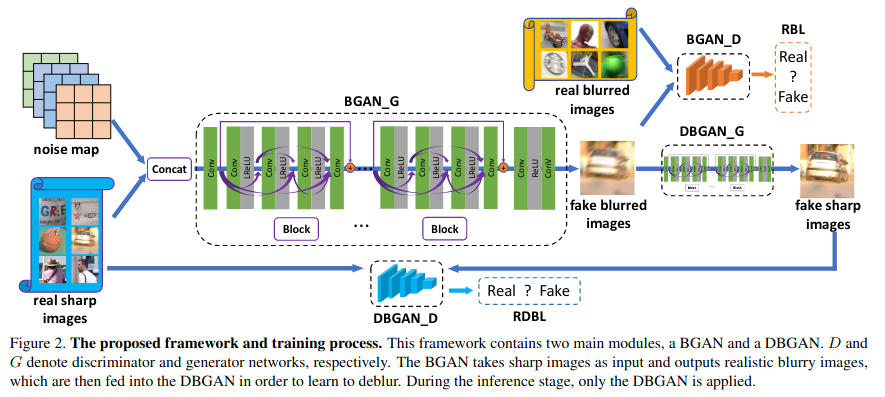

# Deblurring by Realistic Blurring复现

[论文地址](https://arxiv.org/pdf/2004.01860v2.pdf)

使用了两个GAN，一个用来把图片变模糊BGAN、一个用来把图片变清晰DBGAN，前者作为后者的先验

图像生成过程：

1. 清晰的图像传入BGAN，生成模糊的图像
2. 生成的模糊图像与数据集中的模糊图像传入DBGAN，生成清晰图像

损失采用：relativistic blur loss(TODO(jkhu29): explain what is RBL&RDBL)

## 数据集

文章采用GoPro数据集和论文作者自己创建的真实图像数据集

## 网络结构



BGAN：用于生成模糊图像，清晰图像来自GoPro，模糊图像来自真实世界拍摄，两者并不匹配

GBGAN：用于生成清晰图像，就是DeBlurGAN

### BGAN

1. 使用random(4\*128\*128)加到原图上，形成初步的模糊图
2. 1个Conv2d --> 9个ResBlock --> 2个Conv2d
3. ResBlock: 5个Conv2d(64, 3, 3) --> 4个LeakyReLU
4. 还有一个从输入连到输出的ResBlock

判别器与SRGAN一致

### DBGAN

结构跟BGAN基本一样

1. 去掉BN
2. 16个ResBlock

采用L1损失与GAN的两个损失

### trick

1. 高斯权重初始化，均值为0，方差为0.01
2. 每4个epoch更新权重（没有太大必要，batchsize调大就行）
3. 随机裁减(128\*128)、随机翻转
4. 余弦退火，初始1e-4，当loss收敛后将loss降到1e-6
5. loss超参数 α: 0.005, β: 0.01

```
@inproceedings{zhang2020deblurring,
  title={Deblurring by realistic blurring},
  author={Zhang, Kaihao and Luo, Wenhan and Zhong, Yiran and Ma, Lin and Stenger, Bjorn and Liu, Wei and Li, Hongdong},
  booktitle={Proceedings of the IEEE/CVF Conference on Computer Vision and Pattern Recognition},
  pages={2737--2746},
  year={2020}
}
```

