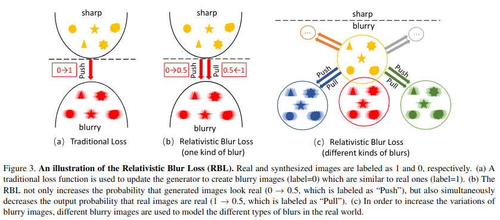

# Deblurring by Realistic Blurring

[article](https://arxiv.org/pdf/2004.01860v2.pdf)

two GANs are used, one for blurring the image(BGAN) and one for deblurring the image (DBGAN), with the former serving as a priori for the latter.

processes:

1. sharp --> bgan --> real blur
2. real blur --> dbgan --> sharp(fake)

losses：relativistic blur loss



the general loss is mainly to ensure that the GANs has the following effects:

1. the probability that the discriminator considers img to be the real category tends to be infinitely close to 1
2. the probability that the discriminator considers img to be the fake category tends to be infinitely close to 1

relativistic blur loss is to make p(fake_d) == p(real_d) 

## Data

please see this part in [official implementation](https://github.com/HDCVLab/Deblurring-by-Realistic-Blurring)

but they do not have training script, that's why I write these code.

## Model


BGAN：sharp --> blur

GBGAN：blur --> sharp, like DeblurGAN

### BGAN

1. gaussian noise concat
2. Conv2d --> 9ResBlock --> 2Conv2d (maybe we could use less resblock)
3. ResBlock: 5Conv2d --> 4LeakyReLU (maybe we could use less Conv2d)
4. long res

GAN_D: vgg19, pretrained (without BN)

Because the data set is not aligned, the cyclegan idea is used

### DBGAN

Basically the same as BGAN

1. without BN (why not IN)
2. 16个ResBlock (also, i don't think need so many resblocks)

## Result

| 原图                                            | 模糊后                                               | 去模糊后                                               |
| ----------------------------------------------- | ---------------------------------------------------- | ------------------------------------------------------ |
|  |  |  |
|    |    |    |


## Usage

use tfrecord in pytorch

> you can also see .h5 made in Chinese README

in `./dataset_make`, run

```shell
python dataset_make.py --mode train_blur
python dataset_make.py --mode train_deblur 
```

then `sh train_small.sh`

## TODOs

- [x] format code
- [x] amp `in branch: amp`
- [ ] visdom

## Citation

```
@inproceedings{zhang2020deblurring,
  title={Deblurring by realistic blurring},
  author={Zhang, Kaihao and Luo, Wenhan and Zhong, Yiran and Ma, Lin and Stenger, Bjorn and Liu, Wei and Li, Hongdong},
  booktitle={Proceedings of the IEEE/CVF Conference on Computer Vision and Pattern Recognition},
  pages={2737--2746},
  year={2020}
}
```
